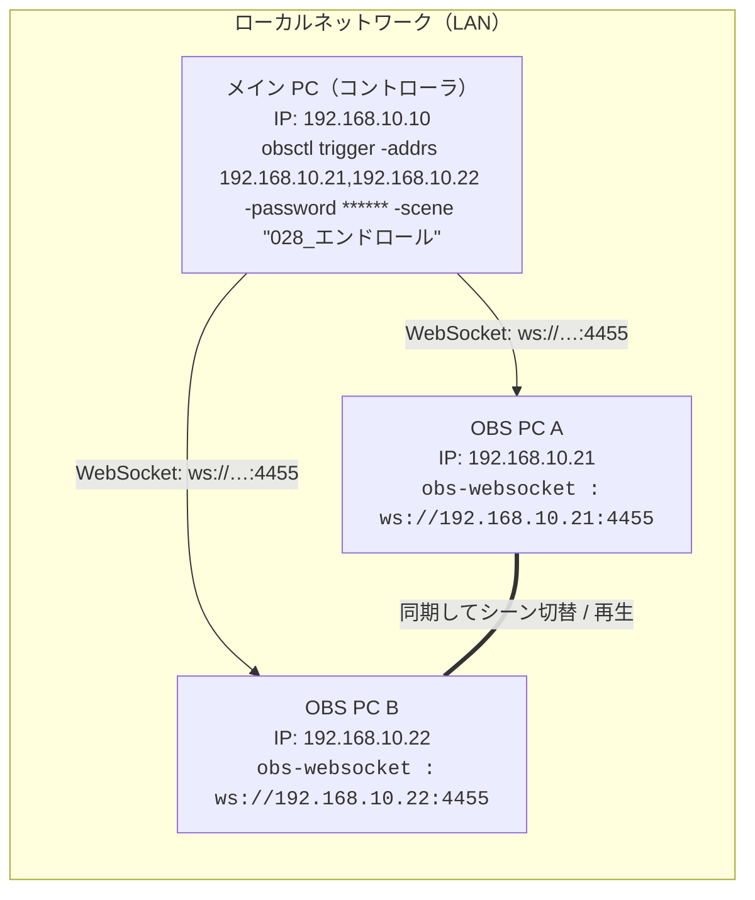

# obsctl

OBS WebSocket を操作するCLIツールです。複数OBSへの同時シーン切替と、動画ディレクトリからのシーン+Media Source 一括作成を提供します。

GUI版（Windows/macOS）は Wails ベースのデスクトップアプリを同梱しています。詳細は `docs/GUI.md` を参照してください。

注意（macOSの警告について）:
- GitHub Releases からダウンロードした `.app` は、Apple公証を行っていないため最初の起動時にGatekeeperの警告が出ます（無料枠では回避不可）。
- 対応策:
  - Finderで`obsctl.app`を右クリック→「開く」→ダイアログの「開く」（初回のみ）
  - もしくはターミナルで隔離属性を削除: `xattr -dr com.apple.quarantine /Applications/obsctl.app`
  - ターミナルインストール（隔離が付きにくい）: `scripts/install-macos.sh` を参照

## クイックスタート

```
go build -o obsctl ./cmd/obsctl
```

例:

```
# 同時シーン切替
./obsctl trigger -addrs 127.0.0.1:4455,127.0.0.1:4456 -password ****** -scene SceneA

# 個別パスワード（-addrs と同順）
./obsctl trigger -addrs 192.168.10.21:4455,192.168.10.22:4455 -passwords passA,passB -scene SceneA

# ディレクトリからシーン作成（トランジション指定と音声モニタリング設定）
./obsctl import -addr 127.0.0.1:4455 -password ****** -dir ./videos -loop -activate -transition fade -monitoring monitor-and-output -debug
```

## コマンド概要

- `trigger`: 複数OBSに対し、指定時刻/遅延で同時にシーン切替を実行
- `import`: ディレクトリ内の動画からシーンと Media Source を一括作成
- `version`: バージョン情報を表示

詳細は `docs/README.md` を参照してください。

## 利用イメージ

