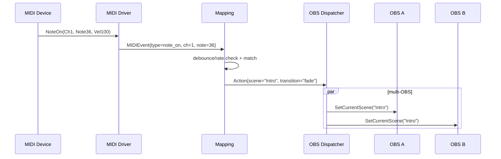

# MIDI入力でのシーン切替 機能設計（draft）

本書は「MIDI の信号を待機し、受信イベントに応じて OBS のシーンを切り替える」機能の設計ドキュメントです。`obsctl` 既存機能（複数 OBS への同時切替、トランジション設定の補助など）を活かしつつ、ライブ運用での堅牢性・低レイテンシを重視します。

## 目的 / ユースケース
- MIDI フットスイッチ/パッドからの操作で、シーンを即時に切り替えたい。
- コントローラのノート/CC/プログラムチェンジに任意のシーンをマッピングしたい。
- 複数台の OBS へ同時に同じ切替を行いたい（既存の複数接続サポートを活用）。
- 誤爆抑止（デバウンス/連打吸収）やフィルタ（チャネル限定、ベロシティ閾値）を入れたい。

## スコープ（MVP）
- 新サブコマンド `midi` の追加（常駐型）
  - 指定 MIDI デバイスをオープンし、ノートオン/オフ、CC、プログラムチェンジを監視
  - イベント→シーン名のマッピング設定に基づき、OBS シーン切替を発火
  - 複数 OBS アドレスへ並列適用（既存 `obsws` の接続・呼び出しパターンを再利用）
- マッピング設定は JSON で提供（CLI フラグで一部上書き可能）
- デバウンス/レート制限のグローバル/個別指定
- 失敗時の再接続（MIDI/OBS）とバックオフ

将来拡張（MVP外）:
- 入力値でフェーダー/クロスフェード等のパラメトリック制御
- トグル/ラッチ/モーメンタリなどの高度なモード
- 複数プロファイル切替、ホットリロード

## CLI 仕様（案）
```
obsctl midi \
  -addrs 127.0.0.1:4455,127.0.0.1:4456 \
  -password ****** \
  -config ./midi.json \
  -device "IAC Driver Bus 1" \
  -channel 1 \
  -debounce 30ms \
  -ratelimit 50ms \
  -debug

# 補助: 利用可能な MIDI 入出力を列挙
obsctl midi ls-devices
```

主なフラグ:
- `-addrs`: カンマ区切りの OBS WebSocket 宛先（既存仕様と同じ）。
- `-password`: すべての接続に用いるパスワード。
- `-config`: マッピング定義（JSON）。
- `-device`: 監視する MIDI 入力ポート名（`-config` より優先）。
- `-channel`: 受け付ける MIDI チャネル（1-16、複数指定は `-config` を推奨）。
- `-debounce`: 全体のデバウンス（個別設定があればそちらが優先）。
- `-ratelimit`: 全体のレート制限（最短間隔）。
- `-debug`: 詳細ログ。

## 設定ファイル（JSON）
現状は `type=note_on` の完全一致（channel + note）に対応しています。CLI の `-map-note` と併用可能で、CLI 指定が優先されます。

例（最小・CH1 Note36 → 028_エンドロール）:
```json
{
  "device": "IACドライバ バス1",
  "channel": 1,
  "debounce": "30ms",
  "rate_limit": "50ms",
  "mappings": [
    { "type": "note_on", "channel": 1, "note": 36, "scene": "028_エンドロール", "transition": "fade" }
  ]
}
```

生成と実行:
```sh
# 生成（OBSのシーン一覧からノート連番を割当）
obsctl midi gen-json -addr 127.0.0.1:4455 -password ****** -channel 1 -start-note 36 -device "IACドライバ バス1" > midi.json

# 実行（JSONを読み込み）
obsctl midi -addrs 127.0.0.1:4455 -password ****** -config midi.json -debug
```
サンプル: `docs/midi.example.json`

## アーキテクチャ
```
+------------------+       +------------------+      +------------------+
| MIDI Driver      | --->  | Event Parser     | ---> | Mapping Engine   | --+ 
+------------------+       +------------------+      +------------------+   |
                                                                            v
                                                                +---------------------+
                                                                | OBS Action Dispatcher|
                                                                |  - multi-addr send   |
                                                                |  - transition set    |
                                                                +---------------------+
```

- MIDI Driver: OS 依存の MIDI 入力ドライバを抽象化。
- Event Parser: ノート/CC/プログラムチェンジを正規化し、共通イベント構造体に変換。
- Mapping Engine: YAML のマッピングとグローバル制御（デバウンス/レート制限/フィルタ）を適用し、アクション（SceneName, Transition）を生成。
- OBS Action Dispatcher: 既存 `internal/obsws` を再利用し、接続のライフサイクルとエラー時の再接続、並列実行、トランジション解決を実施。

### 主要コンポーネント（Go パッケージ案）
- `internal/midi`（新規）
  - `Driver` インターフェース（`Open(deviceName)`, `Close()`, `Events() <-chan MIDIEvent`）
  - `MIDIEvent`（Type, Channel, Note/CC/Program, Value, Timestamp）
  - 実装: RtMidi または PortMidi を薄くラップ（詳細は後述）
- `internal/midimap`（将来）
  - JSON/設定の検証、条件マッチング、デバウンス/レート制御
- `internal/obsws`（既存拡張）
  - 複数接続の維持・再接続（バックオフ）ヘルパ
  - 既存のトランジション名称解決を利用（`resolveTransitionName`）
- `cmd/obsctl/midi.go`（新規）
  - フラグ解析、デバイス列挙、常駐ループの起動/停止

### スレッドモデル
- メイン: CLI 引数解析 → コンフィグロード → OBS 接続群の準備 → MIDI ドライバ起動
- Goroutine1: MIDI 受信（デバイスブロッキング読み取り → `Events()` チャネル）
- Goroutine2: イベント評価（マッピング、デバウンス/レート制限）→ アクションチャネルへ
- Goroutine3: OBS 送信（アクションを受け取り、全接続に並列送出。失敗時はログ+再接続試行）

### エラーハンドリング/リカバリ
- MIDI デバイス切断: ドライバから EOF/エラーを検出 → バックオフ再接続（指数/上限）
- OBS 切断: 既存のパターンに倣い、一定間隔で再接続（ログ抑制/スロットリング）
- 例外/無効イベント: ログのみ（`-debug` 有効時に詳細）

## ライブラリ選定（案）
- 候補:
  - RtMidi ラッパ: クロスプラットフォーム（macOS/Windows/Linux）。C バインディング要。
  - PortMidi ラッパ: クロスプラットフォーム。セットアップ容易。
- 方針: MVP では導入/配布の容易さを優先し、まずは PortMidi または RtMidi のいずれか一方に固定。将来 `internal/midi` でドライバを差し替え可能にする。
- 依存は `internal/midi` でカプセル化して、アプリ側ロジックはインターフェースのみに依存。

## シーン切替の詳細
- トランジション: `transition` をマッピングで指定可能。省略時は既定（`fade`）。実際のローカライズ名称解決は `internal/obsws` の `resolveTransitionName` を使用。
- 同時送出: 既存 `Trigger` 同様、複数接続へ同時に適用。
- タイムアウト: 既存 `withTimeout` ヘルパで個別呼び出しをガード。

## テレメトリ/ログ
- 重要イベント（接続/切断、再接続、マッチ結果、シーン切替結果）を INFO、詳細は DEBUG。
- `-skewlog` に相当する計測は本機能では不要（即時発火のため）。

## テスト計画
- ユニット: 
  - マッピング判定（NoteOnの完全一致）
  - デバウンス/レート制限（同一キーでの抑止）
  - JSON ロード/バリデーション
  - 失敗時の再接続ポリシー（ダミードライバ/モックで検証）
- 結合: `internal/obsws` をモック化し、アクションが正しく呼ばれることを確認
- 手動/E2E: 仮想 MIDI（IAC, loopMIDI, aseqdummy 等）でシーン切替を確認

## 参考実行フロー（シーケンス）


## 移行・互換性
- 既存コマンドへ影響は与えない新規サブコマンド。
- 既存の接続オプション（アドレス/パスワード）とログスタイルに合わせる。

## 開発タスク（実装順序の目安）
1. `internal/midi` 抽象とダミードライバ（テスト用）
2. `internal/midimap`（YAML/判定/デバウンス）
3. `internal/obsws` に接続維持・トランジション指定の薄いヘルパ追加
4. `cmd/obsctl/midi.go` 実装（`runMidi` エントリ）
5. 単体/結合テストとドキュメント更新

---
このドキュメントは初版ドラフトです。要件の詳細（対応デバイス、OS配布形態、既存配布パイプラインへの統合）に応じて調整します。
